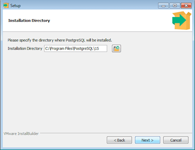
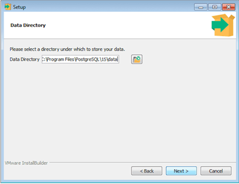
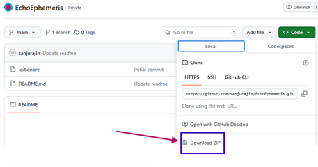

Made for personal use (Arvind Bhai inspired me).

<!--  -->
Requirerments
* Below Steps are for Windows OS (For macOS :- Almost Same. For Linux :- Do you really need)
1. Install python on you PC (Download from https://www.python.org/downloads/)
        Installation Help https://www.geeksforgeeks.org/how-to-install-python-on-windows/
2. Install PostgreSQL  
        (Dowmnload from https://www.enterprisedb.com/downloads/postgres-postgresql-downloads)
        Installation Help
        https://www.enterprisedb.com/docs/supported-open-source/postgresql/installing/windows/
        Note :- i. Installation Location - Keep Default location 
                ii. It will ask location for Data Directory, Change it where you want the database to be like D Drive.
                
                iii. Ensure to put Password during installation, It is essential

Other optional installations

3. Install Power Shell using Windows Store 
        https://apps.microsoft.com/detail/9MZ1SNWT0N5D?hl=en-us&gl=IN&ocid=pdpshare
        (Its optional, Still Install you will appriciate me later )
4. Install Git (Any one from below) 
        https://git-scm.com/downloads
        https://desktop.github.com/download/
        You can also use other alternatives too, search for it.
4. Install VS Code 
        https://code.visualstudio.com/download
        Not Require though
<!--  -->
Now the SETUP Phase

1. Click on Code and Download Zip

2. Extract the Folder somewher (This location will be used more frequent)
3. Open Command Prompt/Power Shell and go to extracted folder 
4.

